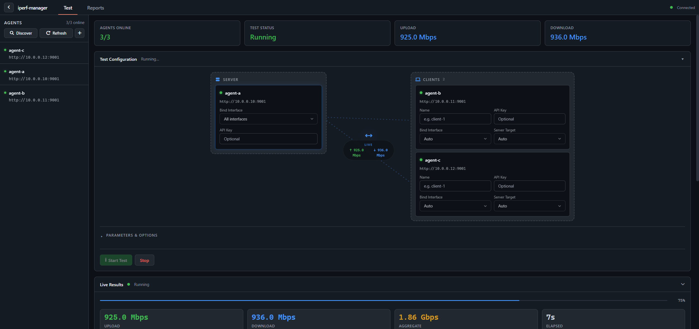
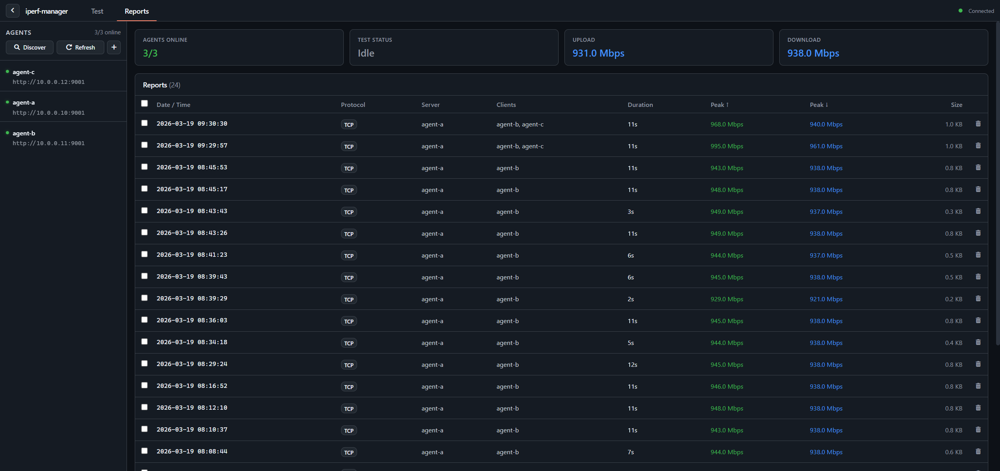

# iperf-manager

iperf-manager is a distributed iperf3 orchestration platform with two deployable components: lightweight agents and a Flask + React web dashboard. Agents run on the systems you want to test, while the dashboard discovers them, builds a server/client topology, starts tests, and visualizes live metrics in the browser.

## Features

- Distributed agent orchestration over REST
- Automatic agent discovery on page load, plus manual Discover and Refresh controls
- Built-in session-based dashboard authentication with secure cookies, enabled by default
- Live topology view and throughput charts over Socket.IO
- TCP and UDP test support
- Dashboard test modes: `bidirectional`, `upload`, `download`
- Saved report browser with inline CSV viewing and raw file download
- CSV, HTML, and ZIP artifacts served from `data/`
- Zero-pip-dependency agent runtime
- Linux and Windows agent deployment scripts, plus a Linux web-service helper

## Screenshots

These screenshots were captured from the live local web UI with agent names, IP addresses, and other environment-specific details redacted.

### Running Dashboard



### Reports View



## Architecture

```text
Browser
  |
  v
Web Dashboard (Flask + React)
  |  REST + Socket.IO
  +--> Agent A (server)
  +--> Agent B..N (clients)

Dashboard flow:
1. Refresh and auto-discover agents on the network
2. Build a topology with one server and one or more clients
3. Start iperf3 on the selected agents
4. Poll live metrics and stream them into the UI
5. Save test artifacts under data/
```

| Component | Description | Entry point |
|-----------|-------------|-------------|
| Agent | Headless REST service that manages iperf3 server/client processes | `main_agent.py` |
| Web Dashboard | Flask + React SPA for discovery, orchestration, live results, and reports | `main_web.py` |

## Quick Start

### Prerequisites

- Python 3.9+
- `iperf3` installed on every agent host
- Node.js only if you are rebuilding the React frontend

### One-liner install/update/uninstall (service deployment)

Linux Web UI:

```bash
curl -fsSL https://raw.githubusercontent.com/IT-BAER/iperf-manager/main/deploy/install-web-linux.sh | sudo bash
```

Linux Web UI update:

```bash
curl -fsSL https://raw.githubusercontent.com/IT-BAER/iperf-manager/main/deploy/install-web-linux.sh \
  | sudo bash -s -- --update
```

Linux Web UI uninstall:

```bash
curl -fsSL https://raw.githubusercontent.com/IT-BAER/iperf-manager/main/deploy/install-web-linux.sh \
  | sudo bash -s -- --uninstall
```

Linux agent:

```bash
curl -fsSL https://raw.githubusercontent.com/IT-BAER/iperf-manager/main/deploy/install-agent-linux.sh | sudo bash
```

Linux agent uninstall:

```bash
curl -fsSL https://raw.githubusercontent.com/IT-BAER/iperf-manager/main/deploy/install-agent-linux.sh \
  | sudo bash -s -- --uninstall
```

Windows agent (PowerShell as Administrator):

```powershell
powershell -NoProfile -ExecutionPolicy Bypass -Command "iwr -useb https://raw.githubusercontent.com/IT-BAER/iperf-manager/main/deploy/Install-Agent.ps1 | iex"
```

Windows agent uninstall:

```powershell
powershell -NoProfile -ExecutionPolicy Bypass -Command "iwr -useb https://raw.githubusercontent.com/IT-BAER/iperf-manager/main/deploy/Install-Agent.ps1 -OutFile $env:TEMP\Install-Agent.ps1; & $env:TEMP\Install-Agent.ps1 -Uninstall"
```

For parameterized install/update commands (token, ports, branch, repo URL, skip build/sync) and staged rollouts, see [deploy/README-deploy.md](deploy/README-deploy.md).

### 1. Start one or more agents

```bash
python main_agent.py --host 0.0.0.0 --port 9001
```

By default, the agent reads its config from:

- Windows: `%LOCALAPPDATA%\iperf3-agent\config.json`
- Linux: `~/.config/iperf3-agent/config.json`

The deployment scripts override that location to system-managed paths. See [deploy/README-deploy.md](deploy/README-deploy.md).
When you use the deployment scripts, they can also generate a random agent API token automatically if you do not pass one explicitly.

### 2. Start the web dashboard

```bash
pip install -r requirements.txt
python main_web.py --host 127.0.0.1 --port 5000
```

Open `http://127.0.0.1:5000`.

Dashboard auth is enabled by default. If you do not set credentials, startup prints a generated `admin` password. When you launch the app directly with `python main_web.py`, that generated password exists only for the current process and rotates on the next restart. For persistent service-managed credentials, configure `DASHBOARD_AUTH_USERNAME` and either `DASHBOARD_AUTH_PASSWORD_HASH` or `DASHBOARD_AUTH_PASSWORD`, or use the Linux setup script, which generates credentials on a fresh install and then preserves the stored hash on later reruns unless you explicitly override the auth settings. To opt out completely, set `DASHBOARD_AUTH_DISABLE=1`.

### 3. Rebuild the frontend when you change the React app

```bash
cd web/frontend
npm install
npm run build
```

If `web/frontend/dist/` is present, Flask serves the built SPA. If it is missing, Flask falls back to the legacy `templates/dashboard.html` template.

### 4. Run a test

1. Let the dashboard auto-discover agents, or use Discover and Refresh manually.
2. Drag one agent into the server zone and one or more into the client zone.
3. Choose protocol, mode, duration, and advanced options.
4. Start the test and watch live upload and download metrics.
5. Review saved artifacts in the Reports tab.

## Dashboard Test Model

The current React dashboard exposes these modes:

| Dashboard mode | Core mode | Description |
|----------------|-----------|-------------|
| `bidirectional` | `bidir` | iperf3 bidirectional mode |
| `upload` | `up_only` | Client to server only |
| `download` | `down_only` | Server to client only |

The dashboard sends a config shape like this to `/api/test/start`:

```json
{
  "server_agent": "server-agent-id",
  "server_bind": "",
  "api_key": "",
  "duration_sec": 10,
  "base_port": 5211,
  "poll_interval_sec": 1,
  "protocol": "tcp",
  "parallel": 1,
  "omit_sec": 0,
  "bitrate": "",
  "tcp_window": "",
  "mode": "bidirectional",
  "clients": [
    {
      "agent": "client-agent-id",
      "name": "client-1",
      "server_target": "",
      "bind": "",
      "api_key": ""
    }
  ]
}
```

## Agent Runtime and API

| Setting | Default | Description |
|---------|---------|-------------|
| `--host` | config value or `0.0.0.0` | Interface to listen on |
| `--port` | config value or `9001` | REST API port |
| Advertise management IP | auto-detect | IP returned in discovery responses |
| iperf3 path | auto-detect | Path to `iperf3` |
| Autostart ports | `5211,5212` | iperf3 server ports to start automatically |
| API token | empty | Optional `X-API-Key` header authentication |

Common endpoints:

| Endpoint | Method | Description |
|----------|--------|-------------|
| `/status` | GET | Agent status and metadata |
| `/metrics` | GET | Live throughput snapshot |
| `/server/start` | POST | Start iperf3 server ports |
| `/server/stop` | POST | Stop iperf3 servers |
| `/client/start` | POST | Start an iperf3 client workload |
| `/client/stop` | POST | Stop agent-side clients |

When an API token is configured, send it as `X-API-Key`.

## Reports and Artifacts

- Test artifacts are written under `data/`.
- The dashboard lists `.csv`, `.html`, and `.zip` report files.
- The React report viewer renders CSV data inline and supports downloading the raw file.
- `core/report.py` still contains the standalone HTML report generator used for HTML report output.

## Build and Deploy

Build the Windows agent bundle with PyInstaller:

```bash
python build.py
```

Useful options:

```bash
python build.py --onefile
python build.py --onedir
python build.py --no-zip
```

See [deploy/README-deploy.md](deploy/README-deploy.md) for:

- Linux agent deployment with systemd
- Windows agent deployment with a scheduled task
- Linux web-dashboard service setup with `deploy/setup-web-service.sh`

## Project Layout

```text
iperf-manager/
  main_agent.py
  main_web.py
  build.py
  requirements.txt
  core/
    agent_service.py
    test_runner.py
    net_utils.py
    csv_recorder.py
    report.py
    config_model.py
    constants.py
    helpers.py
  web/
    app.py
    frontend/
      src/
      dist/
    templates/
  data/
    profiles/
  deploy/
    install-agent-linux.sh
    Install-Agent.ps1
    install-web-linux.sh
    setup-web-service.sh
```

> This is a standalone repository for a server-hosted web dashboard and headless iperf agents.

## License

This project is released under the MIT License. See [LICENSE](LICENSE) for the full text.
